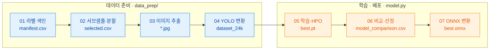

# 화재·연기 검출 YOLO 학습 파이프라인

CCTV 영상에서 **불꽃·연기를 검출**하는 YOLO 모델을 학습하는 파이프라인

**배포 환경별 추천 모델**

| 환경 | 장치 | 추천 모델 | mAP@50-95 | 640px 속도 | 크기(onnx) |
|---|---|---|---|---|---|
| 속도,정확도 균형 | CPU | **YOLOv8s** | 0.622 | 37fps | 45MB |
| 엣지·실시간 감지 | CPU  | **YOLOv8n** | 0.612 | 86fps | 12MB |
| 최고 정확도 | GPU | **YOLOv8m** | 0.638 | 233fps(.pt 기준, 4.3ms) | 104MB |   

> YOLOv8m는 .pt 기준 실측(onnx-gpu 미측정)   

<br>
<br>

## 파이프라인 개요



| # | 단계 | 스크립트 | 하는 일 | 산출 |
|---|---|---|---|---|
| 01 | 라벨 색인 | `data_prep/01_build_manifest.py` | 압축된 원본 데이터(804GB)의 압축을 풀지 않고 JSON 라벨만 스캔하여 메타데이터화 | `manifest.csv` |
| 02 | 서브샘플·분할 | `data_prep/02_subsample_split.py` | 프레임 서브 샘플링을 통해 과적합 방지, train/val에 같은 영상을 넣지 않도록 분할(데이터 누수 방지)  | `selected.csv` |
| 03 | 이미지 추출 | `data_prep/03_extract_images.ps1` | 02에서 샘플링된 이미지만 선별하여 압축해제 | *.jpg |
| 04 | YOLO 변환 | `data_prep/04_convert_to_yolo.py` | COCO JSON → YOLO txt + 이미지 복사 | `dataset_24k` |
| 05 | 학습·HPO | `model.py` | YOLO v5, v8 학습 + Optuna 튜닝 | `best.pt` |
| 06 | 비교·선정 | `model.py` | mAP·속도·크기 → 배포환경별 최적 | `model_comparison.csv` |
| 07 | ONNX 배포 | `model.py` | CPU 추론용 dynamic ONNX | `best.onnx` |

<br>
<br>

## 프로젝트 구조

```
yolo_fire_smoke/
├── config.py               # 중앙 설정 (경로·클래스·파라미터, work/ 경로 앵커)
├── model.py                # 모델 학습·HPO·비교·평가·ONNX 변환 (전 모델작업 단일 CLI)
├── tune_best_yolov8*.yaml  # HPO 산출 하이퍼파라미터 (model.py train --hp 입력)
├── retrain_target.sh       # 현장 오탐(live_fp) 배경 네거티브 재학습 (미실행, 전제조건 주석 참고)
├── SERVER.md               # GPU 서버 학습 절차 (환경·전송·실행·회수)
├── requirements.txt
├── data_prep/              # 데이터 파이프라인 (순차 실행)
│   ├── 01_build_manifest.py   # 라벨 색인 + 통계 (zip 미접근)
│   ├── 02_subsample_split.py  # 클립당 6장 서브샘플 + 클립단위 train/val 분할
│   ├── 03_extract_images.ps1  # 7z로 선택한 jpg만 추출 (분할압축, 원본 불변)
│   ├── 04_convert_to_yolo.py  # COCO JSON -> YOLO txt + 이미지 복사
│   ├── 05_hn_mine.py          # hard-negative 마이닝 (candidates/score/inject)
│   └── 06_hn_extract.ps1      # 마이닝 후보 jpg 선택추출 (원본 불변)
├── api/                    # 추론 백엔드 (FastAPI, 로컬 데모)
│   ├── app.py              #   라우팅 (/detect, /detect/video, /health)
│   ├── detector.py         #   추론 래퍼 (이미지·영상)
│   ├── static/index.html   #   웹 데모 페이지
│   └── README.md
├── hailo/                  # Hailo-8L NPU 배포 (코드만 git, 바이너리·HEF gitignore)
│   ├── prep_inputs.py      #   [x86] onnx·calibration 스테이징 (work/onnx_final → hailo/)
│   ├── compile_to_hef.py   #   [x86] ONNX → HEF 컴파일 (hailomz 래핑)
│   ├── Dockerfile          #   [x86] DFC+HailoRT 컴파일 환경
│   ├── README.md           #   컴파일 가이드
│   ├── hef_output/         #   HEF 산출물 (gitignore)
│   └── rpi/                # [라즈베리파이] HEF 실행
│       ├── setup_rpi.sh    #     HailoRT 설치 + 장치 확인
│       ├── infer.py        #     HEF 추론 (이미지·영상·카메라)
│       └── README.md       #     Pi 실행 가이드
├── work/                   # 산출물 (전체 gitignore)
│   ├── onnx_final/         #   ★ ONNX 최종본 저장소 (model.py export 시 자동 수집, 배포용)
│   ├── runs/               #   학습 결과·가중치 (best.pt)
│   ├── hn/                 #   hard-negative 마이닝 색인
│   ├── .venv/              #   가상환경
│   └── manifest.csv · selected.csv
└── *.pt                    # 사전학습 체크포인트 (yolov8m/8n 등)
```

<br>
<br>

## 1. 데이터셋

화재 현장 데이터(804GB)에서 **2클래스(fire·smoke)** 학습셋을 추려 구성   
정상 장면은 박스 없는 **빈 라벨 네거티브**로 넣어 오탐을 억제

**핵심 용어**

| 용어 | 정의 | 원천 데이터 |
|---|---|---|
| 클래스 | YOLO가 탐지할 객체 종류 | 불꽃(0)·연기(1) 2개 (정상은 배경, 클래스 아님) |
| 클립 | 하나의 영상(사건) 단위 | 1클립 = 12초 = 360프레임 |
| 프레임 | 영상의 순간 이미지(.jpg) | 1920×1080, 30fps (모델 입력) |
| 라벨 | 프레임 내 객체의 위치·종류 | COCO JSON(`bbox=[x,y,w,h]` 픽셀) → 정규화 TXT |


### 1.1 원천 데이터

화재 현장 영상 분할압축(804GB) 상태로 라벨만 색인해 필요한 프레임만 추출

```
📦 Dataset
 ┣ 📂 원천데이터 (📜 TS.zip, TS.z01 ~ TS.z08 (총 804GB, 분할압축))
 ┃ ┗ 📂 화재현상
 ┃    ┗ 📂 이미지
 ┃       ┗ 📂 {클래스} / 📂 {장소} / 📂 {클립} / 📂 JPG / 📜 *.jpg
 ┗ 📂 라벨링데이터
    ┗ 📂 TL
       ┗ 📂 화재 현상 (⚠️ 경로명 공백 주의)
          ┗ 📂 ...
             ┗ 📂 JSON / 📜 *.json (학습용 라벨)
```

- 파일명 : `{클립}_{클래스}_{장소코드}_{프레임}.jpg` (예: `0087_FL_FWW_00001`)
- 이미지 경로 : `화재현상`(공백X) vs 라벨 경로 `화재 현상`(공백O) 표기 다름
- `화재현장 주요객체(소화기 등 15종)` 데이터는 학습에서 제외

#### 클래스 · 장소

| 장소 유형 (코드) | 불꽃 (FL) | 연기 (SM) | 정상 (NONE) | 클립 합계 |
|---|---|---|---|---|
| 일반주택·공동주택 (GAH) | 434 | 267 | 72 | 773 |
| 공장·창고·작업장 (FWW) | 277 | 172 | 64 | 513 |
| 음식점·노래방·주점 (ENB) | 160 | 389 | 37 | 586 |
| 차량·철도·선박 (VTSP) | 112 | 243 | 192 | 547 |
| 노유자·숙박·의료시설 (OLMF) | 177 | 215 | 48 | 440 |
| 교육·연구·업무시설 (ERBF) | 150 | 188 | 126 | 464 |
| 종교·운동시설 (RE) | 131 | 172 | 129 | 432 |
| 시장·상점 (MS) | 256 | 51 | 180 | 487 |
| **총 클립 수** | **1,697** | **1,697** | **848** | **4,242** |
| **총 프레임 수** | **610,920** | **610,920** | **305,280** | **1,527,120** |

<br>

### 1.2 데이터 준비 — 핵심 설계

스크립트 단계는 상단 *파이프라인 개요*(`data_prep/` 01~04)를 참고

- **서브샘플링** : 중복·과적합 억제를 위해 **클립당 6프레임만** 뽑아서 샘플링
- **클립 단위 분할** : 같은 클립이 train/val에 섞여서 **데이터 누수**가 발생하지 않게 분할
- **선택 추출** — 800GB·30fps라 압축을 다 풀지 않고 라벨 색인으로 **필요한 jpg만** 7z 추출 
- **2클래스 + 네거티브** — fire/smoke만 박스로 학습하고, 정상은 빈 라벨로 넣어 오탐을 억제

<br>

### 1.3 학습 데이터

원천을 **클립 단위로 서브샘플링**(train/val 누수 방지)해 만든 2클래스 데이터셋.

| 항목 | 값 |
|---|---|
| 클래스 | `fire`(0), `smoke`(1) |
| 규모 | 23,958장 (train 19,188 / val 4,770), 박스 26,056개 |
| 학습 해상도 | 1280px(6종 벤치마크) · **640px(현 배포·엣지)** |

```
📦 LLM/DATA/datasets/fire_smoke_yolo
 ┣ 📜 data.yaml (dataset_24k 경로 및 클래스 설정)
 ┣ 📜 data_48k.yaml (dataset_48k 경로 및 클래스 설정)
 ┣ 📂 hardneg (hard-negative 마이닝: 정상 영상서 오탐한 배경, 학습에 빈 라벨로 주입)
 ┣ 📂 dataset_48k (기본 학습셋 2배수 샘플링 / 현재 학습 미사용)
 ┗ 📂 dataset_24k (기본 학습셋: 총 23,958장)
    ┣ 📂 images
    ┃  ┣ 📂 train (19,188장) ──  *.jpg
    ┃  ┗ 📂 val   (4,770장)  ──  *.jpg
    ┗ 📂 labels
       ┣ 📂 train            ──  *.txt
       ┗ 📂 val              ──  *.txt

```

<br>
<br>

## 2. 평가지표

화재 탐지는 놓치지 않는 것(재현율)이 최우선이고, 동시에 잘못 울리지 않는 것(오탐 억제)도 중요함    

**검출 성능 (박스를 얼마나 잘 치나)**

| 지표 | 예시 | 방향 |
|---|---|---|
| mAP@50 | 예측 박스가 정답과 **50% 겹치면** 정답 처리 → "탐지 여부" | 높을수록 좋음 |
| mAP@50-95 | mAP50부터 5단위로 mAP95까지 평균 → "위치·크기 정확도" | 높을수록 좋음 |
| 정밀도 (Precision) | 모델이 "불"이라 한 것 중 **진짜 불**의 비율 | 높을수록 오탐 적음 |
| 재현율 (Recall) | 실제 불 중 모델이 **잡아낸** 비율 | 높을수록 놓침 적음 |

**경보 성능 (정상을 비정상으로 보나)**

| 지표 | 예시 | 방향 |
|---|---|---|
| 오탐율 (FAR) | 불·연기 없는 **정상 장면을 화재로 잘못 울린** 비율 | 낮을수록 좋음 |

**운영 방침**
- 화재는 **놓치면 대형 사고** → **재현율(recall)을 우선**한다.
- 대신 오탐이 잦으면 경보 신뢰를 잃으므로, conf(신뢰도 문턱값)로 놓침·오탐 균형을 조절한다.
  (문턱값 ↑ = 오탐 줄고 놓침 늘어남 / 문턱값 ↓ = 그 반대)

<br>
<br>

## 3. 모델 벤치마크 (6종)

- **학습 조건** : 데이터 24,000장 | 1280px | 100 Epoch | auto Optimizer (MuSGD)   
- **추론 환경**: GPU = .pt (PyTorch) / CPU = .onnx (ONNX Runtime)   
- **결론**
  - 모든 체급에서 YOLOv8 > YOLOv5(u)
  - 균형은 **YOLOv8s**, 엣지·실시간은 **YOLOv8n**, 최고정확도는 **YOLOv8m** (상단 추천 표)
  - **용도별**: 업로드 분석(이미지·영상)은 프레임 샘플링이라 CPU로 충분 / 라이브 실시간은 체급·해상도 민감(CPU는 640px+소형만 30fps)   


### 3.1 체급별 정확도(mAP) vs 파일 크기

정확도 차이는 작지만 크기는 **8배 이상 벌어짐**(12~104MB)   
-> 배포 환경(엣지·CPU·GPU)에 맞는 **체급 선택이 핵심**

| 모델 | mAP@50 | mAP@50-95 | 파라미터 | .pt | onnx |
|---|---|---|---|---|---|
| YOLOv8m | 0.905 | **0.638** | 25.8M | 52MB | 104MB |
| YOLOv5m | 0.904 | 0.627 | 25.1M | 51MB | 101MB |
| YOLOv8s | 0.895 | 0.622 | 11.1M | 23MB | 45MB |
| YOLOv8n | 0.894 | 0.612 | 3.0M | 6MB | 12MB |
| YOLOv5s | 0.880 | 0.603 | 9.1M | 19MB | 37MB |
| YOLOv5n | 0.879 | 0.598 | 2.5M | 5MB | 10MB |

<br>

### 3.2 속도 · 실시간 처리율

프레임당 추론 시간(ms)과 초당 처리 프레임 수(fps)를 기준으로 실시간 제어 성능을 평가
- **라이브 30 fps 실시간 판정 기준 (CPU)**
  - ✓ (적합): 30 fps 이상 (지연 없는 실시간 감시 가능)
  - △ (유의): 20 ~ 29 fps (미세한 지연 발생 가능)
  - ✗ (부적합): 20 fps 미만 (실시간 처리 불가능)
- 전 모델이 GPU(.pt) 환경에서는 200 fps 이상을 달성하여 상시 실시간 구동이 가능

| 모델 | CPU (640px) | CPU (1280px) | GPU(.pt) |
|---|---|---|---|
| YOLOv8m | 65ms · 15fps ✗ | 280ms · 3.6fps ✗ | 4.3ms |
| YOLOv5m | 50ms · 20fps ✗ | 204ms · 4.9fps ✗ | 3.6ms |
| YOLOv8s | 27ms · 37fps ✓ | 117ms · 8.5fps ✗ | 1.8ms |
| YOLOv8n | 12ms · 86fps ✓ | 45ms · 22fps △ | 0.8ms |
| YOLOv5s | 22ms · 46fps ✓ | 86ms · 12fps ✗ | 1.7ms |
| YOLOv5n | 9ms · 109fps ✓ | 34ms · 30fps ✓ | 0.7ms |

<br>

### 3.3 영상 분석 시간

12초 클립을 대상으로 배치(Batch) 분석을 수행할 때의 소요 시간(CPU ONNX 기준)
- 분석 조건: 12초 클립당 6프레임만 균등 샘플링하여 분석
- 표기 규칙: 순수 추론 시간 (디코드 · NMS 오버헤드 +20~30% 포함 실제 추정 시간)

| 모델 | 640px | 1280px |
|---|---|---|
| YOLOv8m | 0.4s (0.5s) | 1.7s (2.2s) |
| YOLOv5m | 0.3s (0.4s) | 1.2s (1.6s) |
| YOLOv8s | 0.2s (0.3s) | 0.7s (0.9s) |
| YOLOv8n | 0.1s (0.2s) | 0.3s (0.4s) |
| YOLOv5s | 0.1s (0.2s) | 0.5s (0.7s) |
| YOLOv5n | 0.05s (0.1s) | 0.2s (0.3s) |

<br>
<br>

## 4. 하이퍼파라미터 튜닝 (HPO)

3장 벤치마크에서 **CPU·엣지 배포 후보로 좁혀진 YOLOv8s·8n**을 대상으로, Optuna 프레임워크를 활용하여 학습 하이퍼파라미터를 자동 탐색하고 실제 성능 향상 효과를 검증

**📌 핵심 요약 및 결론**
- **일관된 신호:** `8s`·`8n` 모두 **`box` 가중치 ↑ (7.5 → 10~11)** + **`SGD`** 조합이 최적으로 수렴
- **성능 수렴 (천장):** 튜닝값으로 본학습해도 `8s`·`8n` 모두 **mAP50-95 0.61~0.63에 수렴**
- **인사이트:** 튜닝 효과는 미미 → 성능 천장은 파라미터가 아니라 **'연기'의 비정형 특성**


### 4.1 탐색 방식 및 환경

* **활용 도구:** Optuna (`TPESampler` + `MedianPruner`), 모델 체급별(`8s`·`8n`) 개별 Study 분리 운영
* **프록시(Proxy) 고속 탐색:** **전체 데이터 15% · 30 Epoch · 640px**로 많은 조합을 빠르게 실험
  * 성능이 저조한 Trial은 중간에 가지치기(`Pruning`)하여 조기 중단
* **탐색 파라미터 군:** `lr0`, `lrf`, `momentum`, `weight_decay`, `warmup`, `optimizer` (SGD vs AdamW), Loss 가중치(`box`, `cls`, `dfl`), 데이터 증강(`hsv`, `degrees`, `translate`, `scale`, `shear`, `mosaic`, `mixup`)
* **최적화 지표 (Fitness):** `Fitness = 0.1 × mAP50 + 0.9 × mAP50-95`

<br>

### 4.2 HPO 탐색 결과

* **공통 도출 신호:** `box` 가중치 대폭 상향 (7.5 → 10~11), `cls`·`dfl` 가중치 소폭 상향, 옵티마이저는 `SGD`가 우세함.
* *※ 참고: Best Fitness (Proxy)이 낮게 측정된 이유는 '15% 데이터, 30ep, 640px'이라는 축소 탐색 조건 때문이며, 본학습 단계에서 정상 회복됨*

| 모델명 | 총 Trial 수 | 완료 / 가지치기(Pruned) | Best Fitness (Proxy) |
| :--- | :---: | :---: | :---: |
| **YOLOv8s** | 15회 | 9회 / 6회 | 0.362 |
| **YOLOv8n** | 14회 | 6회 / 8회 | 0.314 |

<br>

### 4.3 최종 채택 파라미터

- `box`, `cls`, `dfl`, 증강 파라미터는 모델 간 전이성(Transferability)이 우수하여 HPO 도출값을 그대로 사용
* **`lr0` / `lrf` (학습률) ➔ 0.01 강제 오버라이드**
  * **원인:** 30ep 단기 탐색에서는 보폭이 좁아야(낮은 학습률) 초반 점수가 안정적으로 높게 찍히는 **단기 착시 현상**이 발생 (Optuna의 오판)
  * **조치:** 이 편향된 낮은 값을 100ep 장기 본학습에 쓰면 학습이 중간에 멈춰버리므로(Local minimum), 정상 수렴을 위해 YOLO 정석값(0.01)으로 지정

| 파라미터 (Parameter) | YOLOv8s 채택값 | YOLOv8n 채택값 | 데이터 출처 |
| :--- | :---: | :---: | :---: |
| **box** (바운딩 박스 손실 가중치) | 10.26 | 11.06 | HPO 결과 반영 |
| **cls** (클래스 분류 손실 가중치) | 0.78 | 0.72 | HPO 결과 반영 |
| **dfl** (분포 초점 손실 가중치) | 1.74 | 1.71 | HPO 결과 반영 |
| **mixup** (데이터 증강 비율) | 0.195 | 0.086 | HPO 결과 반영 |
| **optimizer** (최적화 알고리즘) | **SGD** | **SGD** | HPO 결과 반영 |
| **lr0 / lrf** (초기 / 최종 학습률) | **0.01 / 0.01** | **0.01 / 0.01** | **전문가 오버라이드** |

<br>

### 4.4 최종 본학습 결과 및 분석

- **본학습 설정:** 1280px · 전체 데이터 · 100 Epoch · Patience 30 · Cosine LR · Batch 32
- **최종 결론:** `8s`·`8n` 모두 0.61~0.63에 수렴하고, 클래스별로는 **연기(~0.57) < 불꽃(~0.68)**    
  → 성능 천장은 하이퍼파라미터가 아니라 **'연기'의 비정형 특성**(경계 모호·반투명·형태 변화)에 있음.

| 모델명 | mAP50-95 최종 성적 |
| :--- | :---: |
| **YOLOv8s** | 0.629 |
| **YOLOv8n** | 0.610 |

<br>
<br>

## 5. 배포본 최적화 (640 전환 · 오탐교정 · 증강)

벤치마크·HPO로 **모델·파라미터로는 mAP 0.6대가 천장**임을 확인한 뒤, 실제 배포본은 **640px 전환 + 데이터 중심 개선**으로 완성. (주 지표: mAP + **오탐율 FAR**)


### 5.1 640 전환 + 오탐교정 (hard-negative)

- **640px 재학습:** 엣지(Hailo)·실시간 추론을 위해 입력 해상도 1280px → 640px
- **오탐교정(hard-negative):** 배포 모델로 정상 영상 약 9,700장을 채점 → 불·연기가 없는데 오탐지한 **357장을 '빈 라벨'로 학습셋에 추가**
- **357장 오탐교정:** 정확도 손실 없이 오탐율 4.2% → 3.6%

<br>

### 5.2 강한 데이터 증강 적용

오탐교정 모델에 강도 높은 데이터 증강을 추가로 적용해 현장 오탐 방어력을 끌어올림

#### 데이터 증강 전략
- **적용 기법 (다양성 확보)** 
  - 이미지 겹치기 (`mixup 0.15`)
  - 채도·명도 변형 (`HSV`, 저조도 대응)
  - 크기 변형 (`scale 0.7`)
- **배제 기법 (특징 보존) :**  색상(`Hue`) 왜곡 및 상하 반전 엄격 배제 (불꽃의 붉은 색상 및 수직 방향성 단서 보존 목적)

#### 성능 향상 결과
강한 증강 적용 후 **정확도 향상 및 오탐율 감소**

| 평가지표 | 기존 (오탐 교정만) | 최종 (강한 증강 추가) |
| :--- | :---: | :---: |
| **정확도 (mAP50-95)** | 0.654 | **0.665** |
| **오탐율 (FAR)** | 3.6% | **2.6%** |

#### 일반화 성능 평가 (미학습 장소 검증)
학습 데이터에서 특정 장소를 완전히 제외하여 낯선 환경에서의 성능 유지율 검증

| 미학습 장소 | mAP50-95 | In-domain (0.665) 대비 유지율 |
| :--- | :---: | :---: |
| **공장** | **0.359** | **54% (최약)** |
| 차량 | 0.534 | 80% |
| 의료 | 0.554 | 83% |
| 음식점 | 0.603 | 91% |

- **결과 분석:** 증강으로 일반화 성능 소폭 향상(공장 0.335 → 0.359) 

<br>

### 5.3 최종본 확정

오탐교정·증강 단계별 **오탐율(FAR) 흐름**:

| 오탐교정 | 증강 | 오탐율 (FAR) |
| :--- | :---: | :---: |
| 없음 (대조군) | 기본 | 4.2% |
| 357장 | 기본 | 3.6% |
| 357장 | 강함 (배포) | **2.6%** |
| 677장 (+320) | 강함 | 2.8% |

- **677장으로 증량:** 2.6% → 2.8%로 오히려 안 줄어듦 = **357장에서 포화**
- **화질저하 증강:** 현장 화질 모사(압축·노이즈·블러·안개) 증강은 오히려 성능 저하로 제외 (공장 0.359 → 0.350)

**최종 배포본 확정:** `yolov8s_640_aug`
(스펙: YOLOv8s 체급 / 640px / 오탐 교정 Background 357장 / 강한 증강 적용)

<br>
<br>

## 6. 산출물

| 위치 | 내용 |
|---|---|
| `LLM/DATA/datasets/fire_smoke_yolo/dataset_24k` | 학습 데이터셋 24k (train 19,188 / val 4,770) |
| `work/manifest.csv` · `work/selected.csv` | 라벨 색인 / 서브샘플·split 결과 |
| `work/runs/<model>/weights/best.pt` (+ `best.onnx`) | 학습 가중치 + 배포용 ONNX |
| `model_comparison.csv` | 모델 비교표 |

<br>
<br>

## 7. 추후 개선 방향

### 7.1 현재 한계점
- **폐쇄적 산업 환경에서의 성능 급감:** 미학습 도메인 검증 결과, 선박 내부 구조와 유사한 특성(낮은 층고, 철골 구조, 파이프 배관 등)을 가진 **공장 환경에서 성능이 54%로 급감**하는 현상 확인
- **실 배포 환경 최적화 필요:** 오탐 교정 및 일반 데이터 증강 등 알고리즘 내에서 동원할 수 있는 일반적인(In-domain) 성능 향상은 임계점에 도달함   

<br>

### 7.2 향후 개선 방안
- **PCTC 선박 내부 도메인 데이터 확보:** 유사 환경(공장)에서의 성능 저하가 확인된 만큼, 실제 배포처인 **PCTC 선박 내부 주차장 및 차량 선적 데크 CCTV 데이터** 확보가 최우선 과제
- **데이터 수집 타깃 구체화:** 
  1) 선박 특유의 철골 구조물 및 인공 조명(음영, 반사광)이 포함된 환경 데이터 수집
  2) 전기차 운송 환경을 고려하여, 선박 내 밀집된 차량 간격 및 저조도 환경에서의 불꽃·연기 패턴 데이터 집중 확보

<br>

### 7.3 외부 검토 의견 대조 (2026-08-25)

엣지 화재 감지 관련 외부 연구 보고서를 받아 우리 실측과 대조했다. **채택 2건, 기각 3건, 보류 3건.**

#### 대조에서 정정한 것

- **"배경 677장이 권장 상한 10% 를 넘겨 재현율이 붕괴했다"** — 우리 수치와 맞지 않는다.
  전체 23,958장 기준 **357장 = 1.5%, 677장 = 2.8%** 로 둘 다 10%(2,395장) 한참 아래다.
  그리고 우리가 관측한 것은 재현율 붕괴가 아니라 **오탐율 2.6% → 2.8%** 의 미세한 정체다.
  포화는 맞지만 원인이 비율 초과는 아니다. 라벨 다양성 쪽을 의심하는 편이 타당하다.
- **"YOLOv8s 가 37fps 를 점유한다"** — 37fps 는 낼 수 있는 최대치이고 운영값이 아니다.
  배포처(VMS)는 카메라당 **4초에 1회**(조회·감지 중 1초) 판정한다. 37fps 를 전제한
  450프레임 Ring Buffer 설계는 그대로 쓸 수 없다.

#### 채택 (배포처에 반영 완료)

- **경보를 "연속 N회" 에서 "최근 N회 중 M회" 로.** 연기는 기류·조도로 conf 가 출렁이는 것이
  정상인데 연속을 요구하면 한 번만 놓쳐도 처음부터 다시 센다. 보고서가 ByteTrack 의
  2차 연관으로 풀자고 한 문제인데, 객체 ID 가 필요 없는 우리 용도에서는 창(window)으로 충분하다
- **하드 네거티브를 현장에서 모은다.** 배포처가 경보 없이 잡힌 판정의 원본 프레임을
  `data/hardneg/` 에 남기기 시작했다. 좌표만 있는 로그로는 나중에 그 장면을 못 꺼낸다

#### 기각

- **알파 블렌딩 반투명 합성 증강** — 연기 픽셀의 투명도 마스크가 있어야 하는데
  우리 라벨은 **bbox 뿐이다**(segmentation 아님). 마스크부터 만들어야 해서 비용이 다르다
- **FDA(주파수 도메인 적응)** — 소스의 저주파를 타깃 배경의 저주파로 스왑하는 기법이라
  **PCTC 선내 배경 이미지가 있어야 성립한다.** 그 데이터가 없는 것이 애초의 문제다
- **Unreal/Blender Sim-to-Real + CycleGAN + ADDA** — 별도 프로젝트 규모다

#### 보류 (선박 데이터 확보 후 판단)

- **손실 함수 교체(CIoU → WIoU v3 / ShapeIoU)** — 보고서는 CIoU 의 종횡비 패널티가
  mAP 0.57 정체의 원인이라 본다. 우리는 연기의 비정형성을 원인으로 봤다. 둘 다 가설이고
  재학습해야 갈린다. 서버 GPU 시간이 든다
- **탐지 헤드 DCNv3 업그레이드** — 위와 같이 재학습 필요
- **조도 기반 동적 임계값** — 먼저 잴 것이 있다. 배포처의 `detections-*.jsonl` 에
  판정이 쌓이고 있으니, **오탐이 실제로 조도와 상관있는지** 확인한 뒤 넣는다

#### 별건 — KISA 인증

보고서가 짚은 KISA '방화' 기준(발생 전후 -2초~+10초 인지, 10초 이상 지속 추적)은
**우리 현재 구조로는 충족하지 않는다.** 객체 ID 가 없어 "화면 어딘가에 불이 있었다"만 안다.
인증이 목표가 되면 ByteTrack 같은 경량 추적기가 필요하다. 지금은 목표가 아니라 기록만 남긴다.
